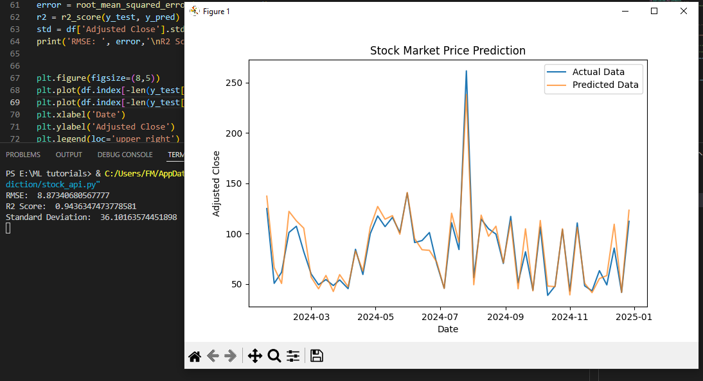

<h1>Stock Price Prediction using Simple Linear Regression Model</h1>

This project predicts stock prices using a machine learning model and historical stock market data from AlphaVantage API. It is designed for educational purposes
and demonstrates how to build a simple stock price prediction model using Linear Regression.
 

<h3>Table of Contents</h3>
<ul>
  <li>Overview</li>
  <li>Dataset & API Setup</li>
  <li>Dataset & Preprocessing</li>
  <li>Results & Model Performace</li>
  <li>Future Improvements</li>
  <li>Acknowledgments</li>
</ul>

<h3>Overview</h3>
<ul>
  <li><b>Data Source:</b> AlphaVantage API (Weekly Adjusted Stock Prices)</li>
  <li><b>Features Used:</b> Percentage Change of Open and Close prices, Volatility, Volume, and Adjusted Close</li>
  <li><b>Target Variable:</b> Future Adjusted Close Price</li>
  <li><b>Model Used:</b> Linear Regression </li>
  <li><b>Evaluation Metrics:</b> RMSE, Standard Deviation, and R2 score</li>
</ul>

<h3>Dataset & API Setup</h3>

  The Weekly Adjusted Time Series data for this project was retrieved from AlphaVantage API. The data contains the last trading day of each week(Date), weekly open, weekly high, weekly low, weekly close, weekly adjusted close, weekly volume, and weekly dividend. To get the data 
  <ol>
    <li>Go to https://www.alphavantage.co/</li>
    <li>Go to <b>Get Free API Key</b> for your API key</li>
    <li>Fill out the form and save your API key</li>
    <li>Go to https://www.alphavantage.co/documentation/ to get the URL of your data</li>
  </ol>

  <b>Code to extract JSON data</b> 
  Change the apikey=demo with your API key 
  <pre><code>
    url = 'https://www.alphavantage.co/query?function=TIME_SERIES_WEEKLY_ADJUSTED&symbol=IBM&apikey=demo'
    r = requests.get(url)
    if r.status_code == 200:
      data = r.json()
      with open('file_name.json', 'w') as json_file: ## change the filename
          json.dump(data, json_file, indent=4)
      if 'Weekly Adjusted Time Series' in data:
          stock_data = data['Weekly Adjusted Time Series']
    else:
        print('Failed to create the file!')
  </code></pre>

<h3>Dataset & Preprocessing</h3>
<ul>
  <li>Extracted data from API in JSON format</li>
  <li>Converting the dictionary into Pandas Dataframe</li>
  <li>Converting date column to datetime and set it as index</li>
  <li>Calculated the percentage change and volatility</li>
  <li>Created a 'label' column forecasting the target variable</li>
  <li>Scaled features using StandardScaler</li>
</ul>

<h3>Results & Model Performace</h3>
To know if the model is performing well, we can check:
<ul>
  <li>If RMSE < Standard Deviation</li>
  <li>If R2 score is close to 1.0</li>
</ul>
The evaluation metrics for this model:
<ul>
  <li>RMSE: 8.873</li>
  <li>Standard Deviation: 36.101</li>
  <li>R2 score: 0.943</li>
</ul>
This indicates the model's good performance and accuracy in prediction 
 

<h3>Future Improvements</h3>
<ul>
  <li>Try to predict the percentage change of Adjusted Close price to analyze the trend and momentum</li> 
  <li>Try models like Random Forest, XGBoost, or LSTM</li>
  <li>Use moving averages as features</li>
</ul>

<h3>Acknowledgments</h3>
<ul>
  <li>AlphaVantage API - for providing stock market data</li>
  <li>Scikit-learn - for ML model and preprocessing tools</li>
  <li>Necessary Libraries and module (request, json, pandas, numpy,)</li>
  <li>Matplotlib - for data visualization</li>
  <li>Youtube Channel - Sentdex(https://www.youtube.com/watch?v=lN5jesocJjk&list=PLQVvvaa0QuDfKTOs3Keq_kaG2P55YRn5v&index=3)</li>
  <li>ChatGPT - for guidance and explanation of concepts</li>
</ul>

